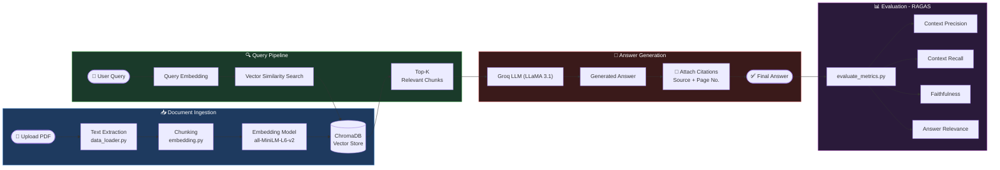

# 📄 AI Research Assistant (RAG)

An end-to-end **Retrieval-Augmented Generation (RAG)** application that lets you upload research papers (PDFs), ask questions grounded in their content, and receive fact-based answers with source citations.

---

## 🚀 Features

| Feature | Description |
|--------|-------------|
| **📤 Multi-PDF Upload** | Upload one or more research papers in PDF format |
| **🔍 Semantic Retrieval (RAG)** | Relevant document chunks retrieved using vector embeddings (SentenceTransformers + ChromaDB) |
| **🤖 LLM-Powered Answers** | Answers generated using Groq-hosted LLMs (via LangChain), strictly constrained to retrieved content |
| **📚 Metadata-Based Citations** | Every answer includes deterministic citations (PDF name + page number) — no hallucinated references |
| **📊 RAG Evaluation (RAGAS)** | Quantitative evaluation using context precision, recall, faithfulness, and answer relevance |
| **⚡ Optimized Latency** | ~2.63 seconds average end-to-end query response time |
| **🧱 Modular Architecture** | Clean separation between ingestion, embedding, vector storage, retrieval, evaluation, and UI |
| **🖥️ Interactive Streamlit UI** | Simple, intuitive interface for document upload and question answering |

---

## 🧠 System Architecture

### 🔄 RAG Pipeline

---

### 📁 Project Structure
```
src/
├── data_loader.py       → Load & parse PDFs
├── embedding.py         → Chunk + embed text
├── vectorstore.py       → Store embeddings in ChromaDB
├── search.py            → Retrieval + LLM generation (RAG)
├── evaluate_rag.py      → Generate model outputs
├── evaluate_metrics.py  → RAGAS evaluation
└── app.py               → Streamlit UI
```
---

## 🛠️ Tech Stack

| Component | Technology |
|-----------|------------|
| **Language** | Python |
| **UI** | Streamlit |
| **Embeddings** | SentenceTransformers (`all-MiniLM-L6-v2`) |
| **Vector DB** | ChromaDB |
| **LLM Interface** | LangChain |
| **LLM** | Groq (LLaMA 3.1) |
| **Evaluation** | RAGAS |
| **Package Manager** | uv |

---

## 📦 Installation & Setup

### 1️⃣ Clone the repository
```bash
git clone https://github.com/your-username/rag-project.git
cd rag-project
```

### 2️⃣ Create & activate a virtual environment
```bash
uv venv
```

### 3️⃣ Install dependencies
```bash
# Using uv (recommended)
uv sync

# Or with pip
uv pip install -r requirements.txt
```

### 4️⃣ Set up environment variables

Create a `.env` file in the project root:
```env
GROQ_API_KEY=your_groq_api_key_here
```

> ⚠️ **Never commit `.env` files to version control.**

---

## ▶️ Running the Application

### Start the Streamlit app
```bash
# With uv
uv run streamlit run app.py

# Without uv
streamlit run app.py
```

### Run the Evaluation Pipeline

1. **Generate model outputs:**
```bash
   python -m src.evaluate_rag
```

2. **Compute RAGAS metrics:**
```bash
   python -m src.evaluate_metrics
```

3. Analyze:
-  Retrieval quality (precision & recall)
-  Generation quality (faithfulness & relevance)
-  System latency

---

## 💡 Usage

1. Upload one or more PDF research papers
2. Click **Index Documents** to process and embed them
3. Ask any question about the uploaded papers
4. View the generated answer along with **source citations** (PDF name + page number)

---

## 🌱 Future Enhancements

-  Hybrid retrieval (BM25 + dense embeddings)
-  Literature review matrix generation
-  CSV / Excel export of extracted insights
-  Streamlit Cloud deployment
-  UI enhancements  